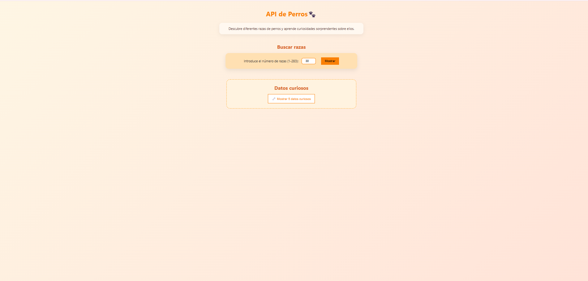
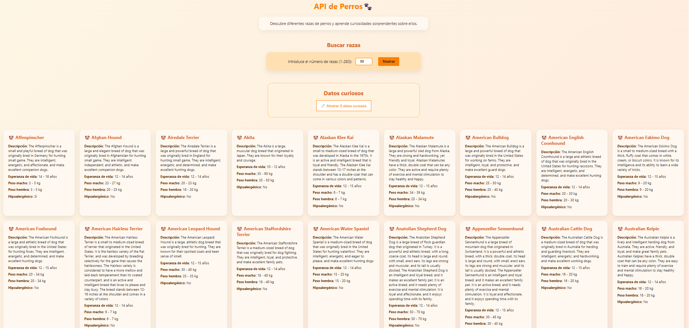
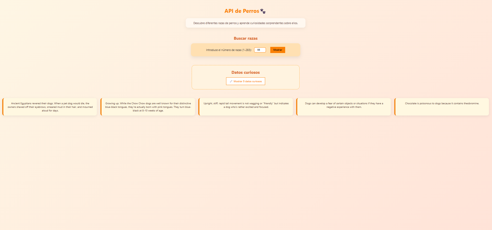
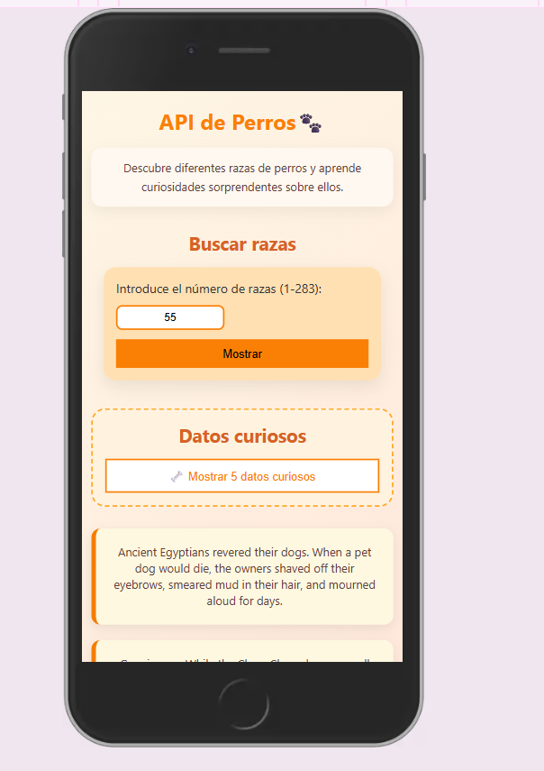
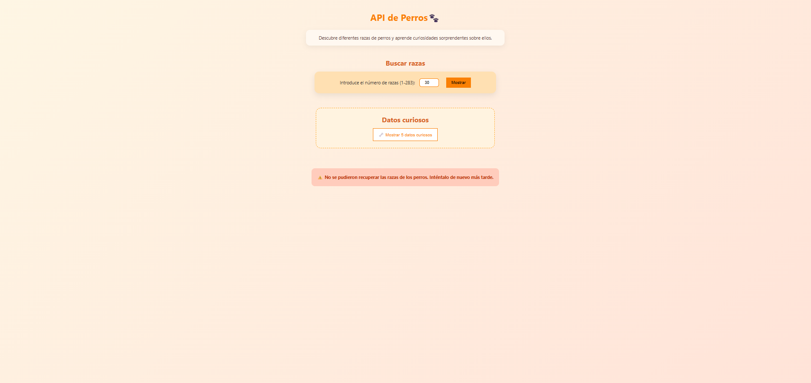

# API de Perros 🐾

Aplicación web que consume la API pública **dogapi.dog** para:
- Mostrar un listado de razas de perros (con límite configurable).
- Mostrar 5 datos curiosos aleatorios sobre perros.

Está pensada como proyecto de portfolio para practicar **AJAX**, **jQuery**, consumo de **APIs REST** y maquetación con **CSS responsive**.

## 🌐 Demo 
https://sandragonzalezdiaz1.github.io/zaragoza-monuments-app/

## 📷 Capturas
### Vista principal

### Vista de resultados de las razas

### Vista de resultados de los datos curiosos

### Vista móvil

### Mensaje de error

## ✨ Funcionalidades
- **Buscar razas**: el usuario indica cuántas razas quiere mostrar (1–283).
- **Datos curiosos**: botón para obtener 5 facts aleatorios.
- **Estados de UI**:
  - Mensaje de carga “🐶 Cargando datos...”
  - Mensajes de error controlados si la API falla o si el número no es válido.
- **Diseño responsive**: layout adaptable a móvil/tablet/desktop.

## 🛠️ Tecnologías utilizadas
- HTML5
- CSS3 (layout responsive)
- JavaScript
- jQuery (AJAX)
- API: https://dogapi.dog/

## 👩‍💻 Autor 
Sandra González
Desarrolladora Web Junior

GitHub: https://github.com/sandragonzalezdiaz1
